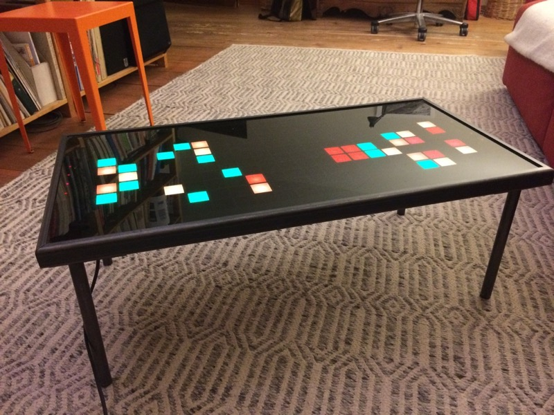
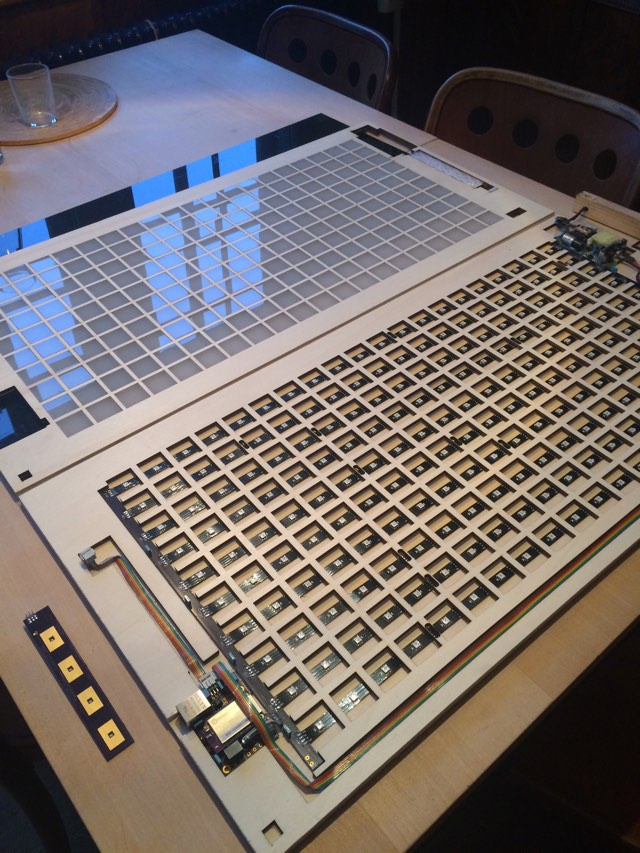

# pixelboardd - daemon for games/display on 20x10 LED WS281x "pixelboard"

**work in progress!**

For running on OpenWrt/LEDE targets such as Onion Omega1/Omega2, you may want to use the pixelboardd and pixelboard-config packages from the [plan44 feed](https://github.com/plan44/plan44-openwrt-feed.git).

I will publish all the drawings for lasercutting a 80x40cm pixelboard and the PCB designs for LED connectors, touch panels and onion omega2 based controller later here on github (when it's ready enough for reproduction)